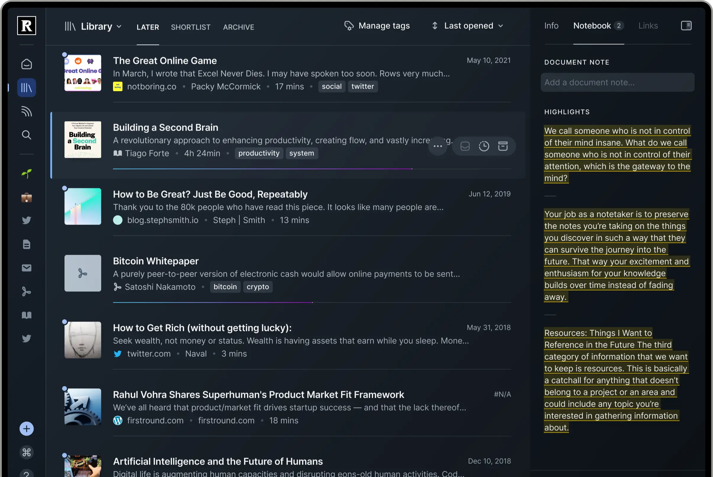
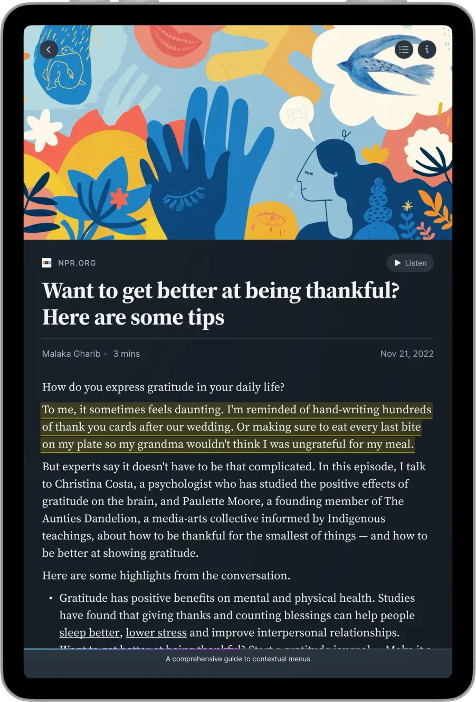
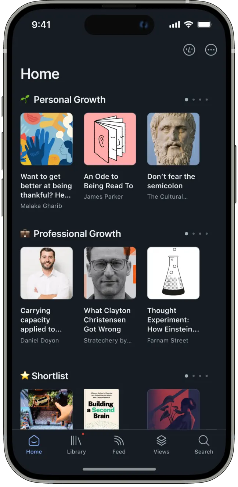
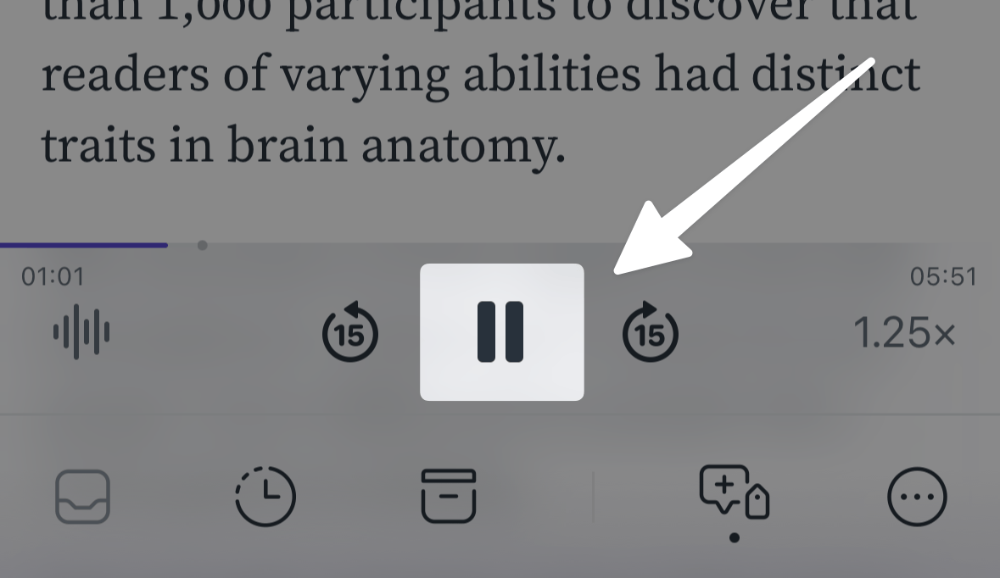
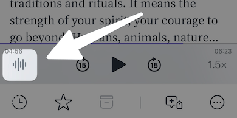

# Readwise Reader reference evidence — issue #4

Retrieved 2026-09-13 from official Readwise public pages. These are the publisher’s unchanged product screenshots/device composites and documentation crops, not private authenticated captures or freshly captured browser screenshots. No generative imagery is included. No browser was available in this agent session; source assets were downloaded from URLs found in official page HTML and then visually inspected.

These assets are research evidence only. Do not ship their branding or document content in the application. The public material may depict older versions; it establishes visual direction, not current feature parity.

## Desktop library

Narrow navigation rail; strong title with quieter metadata; flat rows divided by hairlines; selected row gets a left accent and subtle fill; contextual notebook panel. Transfer row hierarchy and restrained separation, not Readwise branding or article content.

- Source page: https://readwise.io/read
- Original asset: https://d34adp677peecb.cloudfront.net/static/images/reader/Hero-Screen@2x.f141e5a122de.webp
- SHA-256: `dc1207b00ab432311eb9528954be7cc7f167075e08adccb88cd9f641549a8ea0`

## iPad reading chrome

Serif reading copy contrasts with sans-serif UI labels; back, contents and information controls sit at the edges; Listen action remains visible above the reading body; fine bottom progress line. Transfer quiet chrome and type separation, preserving EPUB user font choices.

- Source page: https://readwise.io/read
- Original asset: https://d34adp677peecb.cloudfront.net/static/images/reader/Anywhere-iPad@2x.b213642c953d.webp
- SHA-256: `0f361d7d6686f2142d55f419f6e626b05d91bcfd539d0c9816b13611501e138d`

## Mobile home/library discovery

Cover imagery leads, followed by title and muted author; sections use generous vertical spacing; fixed bottom navigation keeps core destinations reachable. This is the public Home screen, not a capture of the Library tab.

- Source page: https://readwise.io/read
- Original asset: https://d34adp677peecb.cloudfront.net/static/images/reader/Hero-Phone@2x.2ffe333ffd69.webp
- SHA-256: `54666b532fd0c7b13b3b3db8a6bd60c341fcfe3bf699233423336ddb965a8e53`

## Mobile playback controls

Thin progress line with elapsed/remaining time, centered pause action, symmetric 15-second skip buttons, voice control left and speed right. Official documentation already applies a dim overlay and arrow; retain as evidence, not as desired visual styling.

- Source page: https://docs.readwise.io/reader/docs/faqs/text-to-speech
- Original asset: https://docs.readwise.io/images/tts-pause.png
- SHA-256: `e8ec8f43e376e75bf59b48d90ca6479c0551056ce600cca212cfcf6cc84c5db4`

## Mobile voice control entry

Waveform entry at the left of compact playback row; playback controls remain in reading context. This is the voice picker trigger, not the expanded voice picker. The arrow and dim overlay are publisher annotations.

- Source page: https://docs.readwise.io/reader/docs/faqs/text-to-speech
- Original asset: https://docs.readwise.io/images/tts_change-voice.png
- SHA-256: `75eb889d9d1c66fb0023b27a8519d6d82fe71e6ee8c1c03089cc5aa91171f502`

## Direction implications

Use a quiet, dark-neutral shell with fine separators, compact monochrome controls, clear selected-state accents, and distinct reading typography. Preserve light-theme support and existing reader font controls. Favor explicit readable playback labels and a prominent primary transport action.

## Scope limits

Five authentic public references cover desktop library, tablet reading chrome, mobile home, playback controls and voice entry. They do not demonstrate the expanded voice picker, Readest offline downloading, or a complete current Readwise desktop reading toolbar. The original landing-page TTS asset was inspected and rejected because it was a decorative waveform, not product UI.
